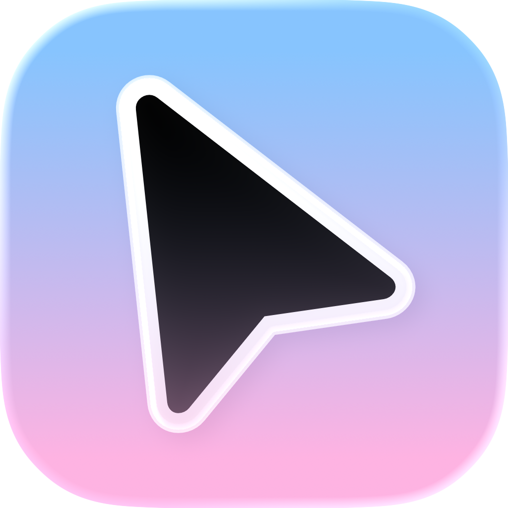

<div align="center">

<h1>Lapsus</h1>
</div>

<div align="center"><h2>What is this?</h2></div>
Lapsus is an application designed to emulate the feeling of using a trackball. It applies "momentum" to your cursor so that it glides (or slides) across the screen until slowly coming to a stop. Lapsus was born out of Magnes, which was an application designed to emulate the iPadOS cursor as a whole.

<div align="center"><h2>Download</h2></div>

You can download Lapsus on the [Releases](https://github.com/margooey/Lapsus/releases) page. You can also download any built artifacts from the [workflow](https://github.com/margooey/Lapsus/actions). 

You can run Lapsus simply by double-clicking on the binary. You can stop the glide behavior by pressing `Ctrl+C` or by killing the terminal session. 

There is currently some work in progress to transition Lapsus into a full macOS .app bundle instead of a CLI app. Part of the work has already been done, which enables the status bar icon and a convenient "Quit Lapsus" option. In the future, you can expect to be able to install Lapsus directly into your Applications folder from a .dmg like a regular app.

<div align="center"><h2>Build</h2></div>

<h3>CLI</h3>

```shell
cargo build --release
```

<h3>MacOS Bundle (.app)</h3>

```shell
cargo bundle --release
```

<div align="center"><h2>Debugging</h2></div>

Debugging is currently work in progress as there are ongoing changes to support Lapsus's transition into a full MacOS bundle. If you need to debug, please uncommment the log builder in `main.rs` and build as CLI.

<div align="center"><h2>Credits</h2></div>

- Yury Korolev: [cidre](https://github.com/yury/cidre)
- jonas-k: [macos-multitouch](https://github.com/jonas-k/macos-multitouch)
- servo: [core-graphics](https://github.com/servo/core-foundation-rs)
- Mads Marquart: [objc2](https://github.com/madsmtm/objc2)


<div align="center"><h2>License</h2></div>
Lapsus is licensed under a custom non-commercial license.